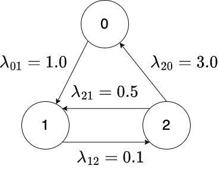

# NMarkov

[](https://travis-ci.com/okamumu/NMarkov.jl)
[](https://codecov.io/gh/okamumu/NMarkov.jl)
[](https://coveralls.io/github/okamumu/NMarkov.jl?branch=master)

NMarkov.jl is a package for numerical computation of Markov chains.

## Installation

This is not in the official package of Julia yet. Please run the following command to install it.
```
using Pkg
Pkg.add(PackageSpec(url="https://github.com/JuliaReliab/Origin.jl.git"))
Pkg.add(PackageSpec(url="https://github.com/JuliaReliab/Deformula.jl.git"))
Pkg.add(PackageSpec(url="https://github.com/JuliaReliab/SparseMatrix.jl.git"))
Pkg.add(PackageSpec(url="https://github.com/JuliaReliab/NMarkov.jl.git"))
```

The packages `Origin`, `Deformula` and `SparseMatrix` are required from NMarkov.

## Load module

```
using NMarkov
```

## Continuous-Time Markov Chain (CTMC)

The CTMC is a stochastic process on discrete state space and continuous time domain.

## Definition of CTMC

The CTMC is defined by a matrix called the infinitessimal generator that represents the state transition rates. For example, we considier the CTMC with three states 0, 1, and 2. Then the infinitesimal generator is generally given by
$$
Q = \begin{pmatrix}
* & \lambda_{01} & \lambda_{02} \\
\lambda_{10} & * & \lambda_{12} \\
\lambda_{20} & \lambda_{21} & *
\end{pmatrix}
$$
where $\lambda_{xy}$ denotes the transition rate from state x to state y. Note that the diagonal elements are determined so that the sum of each row becomes 0, i.e., the (1,1)-entry becomes $-(\lambda_{01}+\lambda_{02})$ in the above case.

Concretely, the state transition is represented by the following diagram.



The infinitesimal generator of the above CTMC can be defined by
```julia
Q = [
    -1.0 1.0 0.0;
    0.0 -0.1 0.1;
    3.0 0.5 -3.5
]
```

In the package, the inifinitesimal generator is allowed to be a sparse matrix provided by `SparseMatrix` package.
```
using SparseArrays
using SparseMatrix

spQ = spzeros(3,3)
spQ[1,2] = 1.0
spQ[2,3] = 0.1
spQ[3,1] = 3.0
spQ[3,2] = 0.5

spQ[1,1] = -1.0
spQ[2,2] = -0.1
spQ[3,3] = -3.5

csr = SparseCSR(spQ)
csc = SparseCSC(spQ)
coo = SparseCOO(spQ)
```
All the matrices `spQ`, `csr`, `csc` and `coo` can be used as the infinitesimal generator of Q in the package.

## Transient Analysis of CTMC

Based on the infinitesimal generator, we compute the state probability vector in which the i-th element indicates the probability that the current state is the state i. From the standard argument of CTMC, the state probability vector at time t $x_t$ is obtained from
$$
x_t = x_0 \exp(Q t)
$$
where $x_0$ is the probability vector at time 0 and $\exp$ is the matrix exponetial function.
In the package, it can be computed by the following code:
```julia
x0 = Float64[1, 0, 0]
t = 2.0
xt = mexp(Q, x0, t, transpose=:T)
```
The function `mexp` can use sparse matrix forms.
```julia
mexp(spQ, x0, t, transpose=:T)
mexp(csr, x0, t, transpose=:T)
mexp(csc, x0, t, transpose=:T)
mexp(coo, x0, t, transpose=:T)
```
where `transpose` option takes either `:T` or `:N`. If `transpose` takes `:N`, it computes
$$
x_t = \exp(Q t) x_0
$$

Also the package provides the function to compute
$$
\bar{x}_t = x_0 \int_0^t \exp(Q u) du
$$
$$
y_t = x_0 \int_0^\infty \exp(Q u) f(u) du
$$
and
$$
\bar{y}_t = x_0 \int_0^\infty \int_0^u \exp(Q s) ds f(u) du
$$
where $f(u)$ is a probability density function.

```julia
xt, barxt = mexpc(Q, x0, t, transpose=:T)
```

```julia
yt = mexpmix(Q, x0, transpose=:T) do u
    1.0 * exp(-1.0 *u)
end
```

```julia
yt, baryt = mexpcmix(Q, x0, transpose=:T) do u
    1.0 * exp(-1.0 *u)
end
```

In the above, $f(u)$ is given by `do` statement. 

## Stationary Analysis

Roughly speaking, the stationary analysis obtains the following state probability vector
$$
x_\infty = x_0 \lim_{t \to \infty} \exp(Q t)
$$
The vector $x_\infty$ is called the limiting probability vector. Also if $\pi$ is given as the solution of the following linear equation
$$
\pi Q = 0, \quad \pi 1 = 1
$$
$\pi$ is called the stationary probability vector. Although the limiting probability vector and the stationary probability vector are not always coincide, they are coincide under some condition.

The package provides the stationary vector of CTMC.
There are two functions to obtain the stationary vector `gth` and `stgs`.

```julia
piv1 = gth(Q)
piv2 = stgs(spQ)
piv3 = stgs(csc)
```

The function `gth` can be applied to a dense matrix only in which GTH algorith is implemented. The function `stgs` can be applied to a CSC-format sparse matrix in which Gauss-Seidel algorithm is implemented.

### Sensitivity analysis of stationary vector

The sensitivity analysis of stationary vector is to compute the first derivative of stationary vector with respect to a transition parameter. Based on the linear equation, we have
$$
\frac{\partial \pi}{\partial \theta} Q + \pi \frac{\partial Q}{\partial \theta} = 0, \quad \frac{\partial \pi}{\partial \theta} 1 = 0
$$

The package provides the functions to compute the sensitivity of stationary vector:
```julia
dQ = Float64[
    -1 1 0;
    0 0 0;
    0 0 0
]
piv = gth(Q)
b = dQ' * piv
dpi = stsen(Q, piv, b)
```
where `dQ` is the matrix obtained from the first derivative of $Q$ with respect to $\lambda_{01}$. `stsen` uses the QR decomposition to obtain the solution.
Essentially, `stsen` is the function to solve the following equation with respect to s:
$$
s Q + b = 0, \quad s 1 = 0
$$
Therefore, it can also be used for obtaining the high-order derivative of stationary vector.

In the case of sparse matrix, we use the different function.
```julia
stsengs(spQ, piv, b)
stsengs(csc, piv, b)
```
They use the Guss-Seidel algorithm to solve the linear equation.

## Quasi-Stationary Analysis

If the CTMC has absorbing states, the stationary vector has domains only on absorbing states. The quasi-stationary vector is the conditional stationary vector provided that the process does not attain to the absorbing states. The the quasi-stationary vector has domains only on transient states.

Suppose that the infinitesimal generator of CTMC has the follwoing structure:
$$
Q = \begin{pmatrix}
T & \xi \\
0 & 0
\end{pmatrix}
$$
where $T$ is the infinitesimal generator over transient states and $\xi$ is a column vector represeinting the transition rates from transient states to an absorbing state. The quasi-stationary vector is defined by
$$
\upsilon T = \gamma \upsilon, \quad \upsilon 1 = 1
$$
where $\gamma ~ (\gamma < 0)$ is the absolute minimum eigen value of T.

The package provides the function to compute the quasi-stationary vector based on Gauss-Seidel algorithm. They use CSC-format sparse matrix only.
```julia
T = [
    -4.0 1.0 0.0;
    0.0 -1.0 0.1;
    3.0 0.5 -3.5
]
xi = -T * ones(3)

qstgs(sparse(T), xi)
qstgs(SparseCSC(T), xi)
```

## Markov Reward Model

to be written

```julia
x = Float64[1, 0, 0]
r = Float64[1, 1, 0]
ts = LinRange(0.0, 10.0, 10)
irwd, crwd, y, cy = tran(Q, x, r, ts)
```

## Special Matrix and Uniformed Transition Probability Matrix

The package provides the function to create some special matrix.

- `eye(n)`: the function to create the n-by-n identity matrix
- `unif(Q)`: the function to obtain the uniformized transition probability matrix from the infinitesimal generator `Q`;
$$
P = I - Q / q
$$
where $I$ is the identity matrix and $q$ is the maximum of absolute values of diagonal elements of $Q$. In addition, there are functions to obtain stationary vector and its sensitivity of $P$

```julia
P, qv = unif(Q)
piv, = stpower(P)
dP = dQ / qv
b = dP' * piv
stsenpower(P, piv, b)
```

Furthermore, `qstpower` is the function to obtain quasi-stationary vector based on power method.

```julia
U, qv = unif(T)
xidash = xi / qv
qstpower(U, xidash)
```
