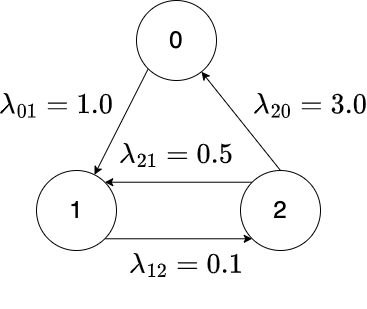

# NMarkov

[](https://github.com/JuliaReliab/NMarkov.jl/actions/workflows/ci.yml)
[](https://codecov.io/gh/JuliaReliab/NMarkov.jl)

NMarkov.jl is a package for numerical computation of Markov chains.

Requires Julia 1.10 or later.

## Installation

Neither this package nor `DEQuadrature` is registered in the official Julia
Registry, so both are installed from their URLs. `ZeroOrigin`, the other
dependency, is registered and resolves on its own.

```julia
using Pkg
Pkg.add(PackageSpec(url="https://github.com/JuliaReliab/DEQuadrature.jl.git"))
Pkg.add(PackageSpec(url="https://github.com/JuliaReliab/NMarkov.jl.git"))
```

## Quick Start

```julia
using NMarkov
```

For examples, see the `examples/` directory which contains runnable scripts for:
- CTMC definition
- Transient analysis
- Stationary analysis
- Sensitivity analysis
- Quasi-stationary analysis
- Markov reward models
- Uniformized matrices

You can run examples with:
```
julia --project=. examples/02_transient_analysis.jl
```
... and so on

## Continuous-Time Markov Chain (CTMC)

The CTMC is a stochastic process on discrete state space and continuous time domain.

## Definition of CTMC

The CTMC is defined by a matrix called the infinitessimal generator that represents the state transition rates. For example, we considier the CTMC with three states 0, 1, and 2. Then the infinitesimal generator is generally given by

```math
Q = \begin{pmatrix}
* & \lambda_{01} & \lambda_{02} \\
\lambda_{10} & * & \lambda_{12} \\
\lambda_{20} & \lambda_{21} & *
\end{pmatrix}
```

where $\lambda_{xy}$ denotes the transition rate from state x to state y. Note that the diagonal elements are determined so that the sum of each row becomes 0, i.e., the (1,1)-entry becomes $-(\lambda_{01}+\lambda_{02})$ in the above case.

Concretely, the state transition is represented by the following diagram.



The infinitesimal generator of the above CTMC can be defined by
```julia
Q = [
    -1.0 1.0 0.0;
    0.0 -0.1 0.1;
    3.0 0.5 -3.5
]
```

In the package, the infinitesimal generator is allowed to be a sparse matrix provided by the built-in `SparseMatrix` submodule.
```julia
using SparseArrays
using NMarkov.SparseMatrix

spQ = spzeros(3,3)
spQ[1,2] = 1.0
spQ[2,3] = 0.1
spQ[3,1] = 3.0
spQ[3,2] = 0.5

spQ[1,1] = -1.0
spQ[2,2] = -0.1
spQ[3,3] = -3.5

csr = SparseCSR(spQ)
csc = SparseCSC(spQ)
coo = SparseCOO(spQ)
```
All the matrices `spQ`, `csr`, `csc` and `coo` can be used as the infinitesimal generator Q in the package.

### Sparse Matrix Formats

The `SparseMatrix` submodule provides efficient sparse matrix formats optimized for Markov chain computations:

- **SparseCSR (Compressed Sparse Row)**: Efficient for row-wise access and matrix-vector products
- **SparseCSC (Compressed Sparse Column)**: Efficient for column-wise access and recommended for many algorithms
- **SparseCOO (Coordinate Format)**: Flexible format for constructing sparse matrices; can be converted to CSR/CSC
- **SparseELL1 / SparseELL2 (ELLPACK Format)**: Efficient for matrices with relatively uniform row lengths
- **BlockCOO (Block Coordinate Format)**: For matrices with dense block structure

Each format has different performance characteristics depending on the operation:
```julia
using SparseArrays
using NMarkov.SparseMatrix

# Convert between formats
M = sparse(Q)         # Julia's native SparseMatrixCSC
csr = SparseCSR(M)    # Convert to CSR format
csc = SparseCSC(M)    # Convert to CSC format
coo = SparseCOO(M)    # Convert to COO format

# Use in computations
piv, = stgs(csc)      # Gauss-Seidel with CSC format
y = mexp(csr, x, t)   # Matrix exponential with CSR format
y = mexp(coo, x, t)   # ... any format, including COO
```

`mexp`, `mexpc`, `tran` and the other transient functions accept every format
above as well as a dense `Matrix`. The Gauss-Seidel solvers are narrower: **`stgs`,
`stsengs` and `qstgs` accept only `SparseMatrixCSC` and `SparseCSC`**, so
**CSC format is the one to reach for** if you need stationary or sensitivity
analysis on a sparse kernel.

## Transient Analysis of CTMC

Based on the infinitesimal generator, we compute the state probability vector in which the i-th element indicates the probability that the current state is the state i. From the standard argument of CTMC, the state probability vector at time t $x_t$ is obtained from

```math
x_t = x_0 \exp(Q t)
```

where $x_0$ is the probability vector at time 0 and $\exp$ is the matrix exponetial function.
In the package, it can be computed by the following code:
```julia
x0 = Float64[1, 0, 0]
t = 2.0
xt = mexp(Q, x0, t, transpose=:T)
```
The function `mexp` can also use sparse matrix forms:
```julia
mexp(spQ, x0, t, transpose=:T)
mexp(csr, x0, t, transpose=:T)
mexp(csc, x0, t, transpose=:T)
mexp(coo, x0, t, transpose=:T)
```
where the `transpose` option takes either `:T` (transpose) or `:N` (no transpose). If `transpose=:N`, it computes

```math
x_t = \exp(Q t) x_0
```

Also the package provides the function to compute

```math
\bar{x}_t = x_0 \int_0^t \exp(Q u) du
```

```math
y_t = x_0 \int_0^\infty \exp(Q u) f(u) du
```

and

```math
\bar{y}_t = x_0 \int_0^\infty \int_0^u \exp(Q s) ds f(u) du
```

where $f(u)$ is a probability density function.

```julia
xt, barxt = mexpc(Q, x0, t, transpose=:T)
```

```julia
yt = mexpmix(Q, x0, transpose=:T) do u
    1.0 * exp(-1.0 *u)
end
```

```julia
yt, baryt = mexpcmix(Q, x0, transpose=:T) do u
    1.0 * exp(-1.0 *u)
end
```

In the above, $f(u)$ is given by `do` statement. 

## Stationary Analysis

Roughly speaking, the stationary analysis obtains the following state probability vector

```math
x_\infty = x_0 \lim_{t \to \infty} \exp(Q t)
```

The vector $x_\infty$ is called the limiting probability vector. Also if $\pi$ is given as the solution of the following linear equation

```math
\pi Q = 0, \quad \pi 1 = 1
```

$\pi$ is called the stationary probability vector. Although the limiting probability vector and the stationary probability vector are not always coincide, they are coincide under some condition.

The package provides the stationary vector of CTMC.
There are two main functions to obtain the stationary vector: `gth` (GTH algorithm) and `stgs` (Gauss-Seidel algorithm).

```julia
piv1 = gth(Q)
piv2, converged, iter, error = stgs(spQ)
piv3, converged, iter, error = stgs(csc)
```

The function `gth` can be applied to dense matrices only and uses the GTH algorithm. The function `stgs` can be applied to sparse matrices (both `SparseMatrixCSC` and custom `SparseCSC` formats) and uses the Gauss-Seidel iteration method. Note that `stgs` returns a tuple containing the solution vector and convergence information.

### Sensitivity analysis of stationary vector

The sensitivity analysis of stationary vector is to compute the first derivative of stationary vector with respect to a transition parameter. Based on the linear equation, we have

```math
\frac{\partial \pi}{\partial \theta} Q + \pi \frac{\partial Q}{\partial \theta} = 0, \quad \frac{\partial \pi}{\partial \theta} 1 = 0
```

The package provides the functions to compute the sensitivity of stationary vector:
```julia
dQ = Float64[
    -1 1 0;
    0 0 0;
    0 0 0
]
piv = gth(Q)
b = dQ' * piv
dpi = stsen(Q, piv, b)
```
where `dQ` is the matrix obtained from the first derivative of $Q$ with respect to $\lambda_{01}$. `stsen` uses the QR decomposition to obtain the solution.
Essentially, `stsen` is the function to solve the following equation with respect to s:

```math
s Q + b = 0, \quad s 1 = 0
```

Therefore, it can also be used for obtaining the high-order derivative of stationary vector.

For sparse matrices, use the `stsengs` function which employs the Gauss-Seidel algorithm:
```julia
dpi = stsengs(spQ, piv, b)
dpi = stsengs(csc, piv, b)
```
Note: When using `stgs`, extract the solution vector from the returned tuple:
```julia
piv, _, _, _ = stgs(spQ)  # Extract the first element
```

## Quasi-Stationary Analysis

If the CTMC has absorbing states, the stationary vector has domains only on absorbing states. The quasi-stationary vector is the conditional stationary vector provided that the process does not attain to the absorbing states. The the quasi-stationary vector has domains only on transient states.

Suppose that the infinitesimal generator of CTMC has the follwoing structure:

```math
Q = \begin{pmatrix}
T & \xi \\
0 & 0
\end{pmatrix}
```

where $T$ is the infinitesimal generator over transient states and $\xi$ is a column vector represeinting the transition rates from transient states to an absorbing state. The quasi-stationary vector is defined by

```math
\upsilon T = \gamma \upsilon, \quad \upsilon 1 = 1
```

where $\gamma ~ (\gamma < 0)$ is the absolute minimum eigen value of T.

The package provides the function to compute the quasi-stationary vector based on Gauss-Seidel algorithm. They use CSC-format sparse matrix only.
```julia
T = [
    -4.0 1.0 0.0;
    0.0 -1.0 0.1;
    3.0 0.5 -3.5
]
xi = -T * ones(3)

qstgs(sparse(T), xi)
qstgs(SparseCSC(T), xi)
```

## Markov Reward Model

The Markov reward model extends the CTMC by associating a reward rate with each state. The total reward accumulated over time is computed by integrating the reward rates weighted by the state probabilities.

The `tran` function computes transient reward analysis for a CTMC with reward vector. Given:
- $x$: initial state probability vector
- $r$: reward vector (reward rate for each state)
- $ts$: time points at which to compute rewards

The function returns four values:

1. **`irwd` (Instantaneous Reward)**: The instantaneous reward rate at each time point
   - $\text{irwd}_t = r^T \cdot x(t)$ (reward at time $t$)

2. **`crwd` (Cumulative Reward)**: The cumulative reward accumulated from time 0 to each time point
   - $\text{crwd}_t = \int_0^t r^T \cdot x(u) \, du$ (total reward up to time $t$)

3. **`y` (Final State Probability Vector)**: the state probability vector at the
   **last** time point — a single vector of length $n$, not one per time point
   - $y = x \exp(Q t_{\text{end}})$

4. **`cy` (Cumulative State Probability)**: the integrated state probability over
   the **whole** interval — again a single vector of length $n$
   - $\text{cy} = \int_0^{t_{\text{end}}} x \exp(Qu) \, du$ (total time spent in each state)

Only `irwd` and `crwd` have one entry per time point. If you need the state
probability vector at every time point, use `mexpc`:

```julia
probs, cprobs = mexpc(Q, x, ts, transpose=:T)
# probs[i]  - state probability vector at ts[i]
# cprobs[i] - cumulative state probability up to ts[i]
```

Example usage:
```julia
Q = [
    -1.0  1.0  0.0;
     0.0 -0.1  0.1;
     3.0  0.5 -3.5
]

# Initial state probability (start from state 0)
x = Float64[1, 0, 0]

# Reward rates for each state
r = Float64[1, 1, 0]

# Time points
ts = LinRange(0.0, 10.0, 10)

# Compute transient reward analysis
irwd, crwd, y, cy = tran(Q, x, r, ts)

# irwd[i]  - instantaneous reward at ts[i]
# crwd[i]  - cumulative reward from 0 to ts[i]
# y        - state probability vector at the last time point (one vector)
# cy       - time spent in each state over the whole interval (one vector)
```

This is useful for computing performance metrics such as:
- Expected cost/profit over a time interval
- Cumulative system availability or unavailability
- Expected reward from different operational modes

## Special Matrix and Uniformed Transition Probability Matrix

The package provides the function to create some special matrix.

- `eye(n)`: the function to create the n-by-n identity matrix
- `unif(Q, ufact = 1.01)`: the function to obtain the uniformized transition probability matrix from the infinitesimal generator `Q`;

```math
P = I + Q / q, \quad q = \text{ufact} \cdot \max_i |Q_{ii}|
```

where $I$ is the identity matrix. The factor `ufact` (default `1.01`) keeps $q$
strictly above $\max_i |Q_{ii}|$, so every entry of $P$ stays positive; `unif`
returns both $P$ and $q$. In addition, there are functions to obtain stationary vector and its sensitivity of $P$

```julia
P, qv = unif(Q)
piv, = stpower(P)
dP = dQ / qv
b = dP' * piv
stsenpower(P, piv, b)
```

Furthermore, `qstpower` is the function to obtain quasi-stationary vector based on power method.

```julia
U, qv = unif(T)
xidash = xi / qv
qstpower(U, xidash)
```

## Examples

### Steady-state analysis

#### Example 1: Dense kernel with the GTH algorithm
Solve the stationary distribution of a 2-state CTMC.

```julia
using SparseArrays
using NMarkov

# parameters
λ = 1 / 100_000
μ = 1 / 10

# infinitesimal generator (dense)
Q = [
    -λ   λ
     μ  -μ
]

# GTH algorithm (dense matrices only)
gth(Q)

# error case (sparse matrix is not allowed)
gth(sparse(Q))
```

#### Example 2: Sparse kernel with Gauss–Seidel (GS) algorithm
Birth–death process with finite capacity (states S₀…Sₙ).

```julia
using SparseArrays
using ZeroOrigin
using NMarkov

λ = 1.0
μ = 2.0
N = 10

Q = spzeros(N+1, N+1)
@origin (Q => 0) begin
    Q[0,0] = -λ
    Q[0,1] = λ
    for i = 1:N-1
        Q[i,i+1] = λ
        Q[i,i-1] = μ
        Q[i,i] = -(λ + μ)
    end
    Q[N,N-1] = μ
    Q[N,N] = -μ
end

# GS algorithm for sparse kernels
x, = stgs(Q)

# error case (dense matrix not allowed)
stgs(Matrix(Q))
```

#### Power method

```julia
P, qv = unif(Q)
x, = stpower(P)
```

#### Example 3: Sensitivity of the stationary distribution

Compute first derivatives of the stationary distribution with respect to parameters λ, μ.

```julia
# stationary vector
π, = stgs(Q)

# derivative w.r.t. λ
dQλ = spzeros(N+1, N+1)
@origin (dQλ => 0) begin
    dQλ[0,0] = -1
    dQλ[0,1] = 1
    for i = 1:N-1
        dQλ[i,i+1] = 1
        dQλ[i,i] = -1
    end
end

# derivative w.r.t. μ
dQμ = spzeros(N+1, N+1)
@origin (dQμ => 0) begin
    for i = 1:N-1
        dQμ[i,i-1] = 1
        dQμ[i,i] = -1
    end
    dQμ[N,N-1] = 1
    dQμ[N,N] = -1
end

dxλ, = stsengs(Q, π, dQλ' * π)
dxμ, = stsengs(Q, π, dQμ' * π)
```

#### Example 4: Quasi-stationary distribution

```julia
λ = 1.0
μ = 2.0
N = 10

Q = spzeros(N+1, N+1)
@origin (Q => 0) begin
    Q[0,0] = -λ
    Q[0,1] = λ
    for i = 1:N-1
        Q[i,i+1] = λ
        Q[i,i-1] = μ
        Q[i,i] = -(λ + μ)
    end
    Q[N,N-1] = μ
    Q[N,N] = -(λ + μ)
end

# exit rate
ξ = zeros(N+1)
@origin ξ=>0 begin
    ξ[N] = λ
end

# GS-type method
x, γ, = qstgs(Q, ξ)

# power method. qstpower works on the uniformized matrix, so the exit rates
# must be scaled by q as well, and the eigenvalue it returns is scaled too:
# γ * qv corresponds to the γ from qstgs.
P, qv = unif(Q)
x, γ, = qstpower(P, ξ / qv)
```

### Transient analysis

#### Transient probabilities

```julia
λ = 1.0
μ = 2.0
N = 10

Q = spzeros(N+1, N+1)
@origin (Q => 0) begin
    Q[0,0] = -λ
    Q[0,1] = λ
    for i = 1:N-1
        Q[i,i+1] = λ
        Q[i,i-1] = μ
        Q[i,i] = -(λ + μ)
    end
    Q[N,N-1] = μ
    Q[N,N] = -μ
end

x0 = zeros(N+1)
@origin x0=>0 begin
    x0[0] = 1.0
end

# single time
xt = mexp(Q, x0, 1.0, transpose=:T)

# time sequence
ts = LinRange(0.0, 10.0, 100)
xt = mexp(Q, x0, ts, transpose=:T)
```

### Expected rewards

```julia
using Plots

# reward: expected number of customers
r = Float64[i for i = 0:N]

ts = LinRange(0.0, 50.0, 100)
irwd, crwd, xt, cxt = tran(Q, x0, r, ts)

plot(ts, irwd)
```

## License

This package is distributed under the MIT License. See LICENSE file for details.

